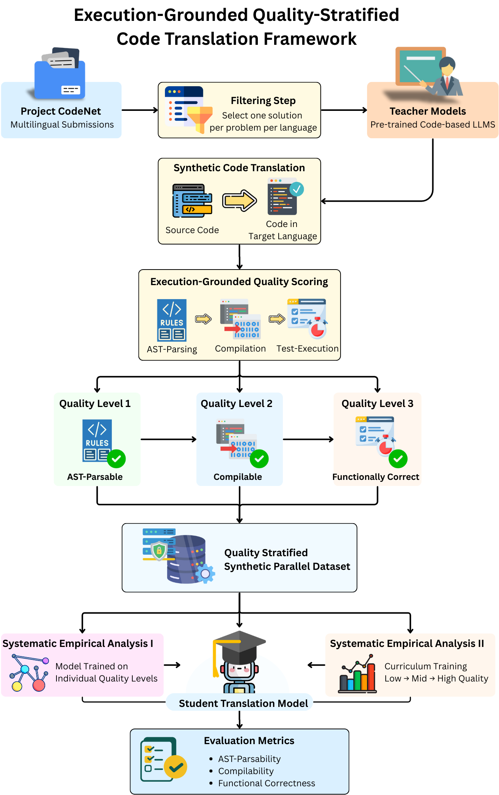

# CodeNetTrans-QS

Quality-Stratified, Execution-Grounded Synthetic Dataset and Training Framework for Code Translation

---

## Overview

CodeNetTrans-QS is the official research repository accompanying the paper:

**Quality as a Continuum: Execution-Grounded Stratification for Synthetic Code Translation**  
Deepak Naik M V, Swaminathan J

This repository provides a complete, end-to-end framework for constructing, training, and evaluating neural code translation models using execution-grounded, quality-stratified synthetic parallel data derived from Project CodeNet.

The central idea of this work is to treat translation quality as a continuum rather than a binary signal. Instead of discarding imperfect translations, the framework retains and organizes them based on progressively stronger execution-level correctness signals, enabling systematic analysis of learnability, generalization, and functional correctness.

---

## Key Contributions

- Execution-grounded synthetic parallel dataset for code translation
- Quality stratification using AST parsability, compilation success, and functional correctness
- Multi-teacher synthetic translation generation
- Curriculum learning over quality levels
- Fully automated and scalable pipeline
- Competitive-programming–level difficulty using Project CodeNet

---

## Dataset Statistics

The CodeNetTrans-QS dataset is constructed from Project CodeNet using an execution-grounded, quality-stratified pipeline.

| Statistic | Value |
|---------|------|
| Source Dataset | Project CodeNet |
| Input Languages | C, C++, C#, Python, Ruby, Kotlin, Swift |
| Target Language | Java |
| Total Problems | 3,260 |
| Train / Validation / Test (problems) | 2,831 / 113 / 316 |
| Total Translation Pairs | 22,856 |
| Teacher Models | StarCoder, QwenCoder, DeepSeek-Coder |
| Quality Levels | AST-parsable (Score 1), Compilable (Score 2), Functionally Correct (Score 3) |
| Dataset Type | Synthetic, parallel, execution-grounded, quality-stratified |

The dataset preserves translations across all quality levels, enabling controlled empirical analysis of how supervision quality influences learnability and executable correctness.

---

## Execution-Grounded Quality-Stratified Framework

<p align="center">
  
</p>

<p align="center">
  <em>
    Execution-grounded quality-stratified code translation framework.
    Multilingual source programs from Project CodeNet are translated using
    multiple teacher models and stratified based on AST parsability,
    compilability, and functional correctness.
  </em>
</p>

---

## Teacher Models

The following pretrained code-centric large language models were used to generate synthetic Java translations from multilingual source programs.

| Model Name | Hugging Face Identifier |
|-----------|-------------------------|
| StarCoderBase | `bigcode/starcoderbase-1b` |
| Qwen2.5-Coder | `Qwen/Qwen2.5-Coder-1.5B-Instruct` |
| DeepSeek-Coder | `deepseek-ai/deepseek-coder-1.3b-instruct` |


---

## Unified Translation Prompt

All synthetic Java translations in CodeNetTrans-QS are generated using a single unified prompt template.  
The prompt explicitly specifies the source language, enforces semantic preservation, and restricts the output to valid Java source code.

```text
### Task:
Translate the following {input_language} program into Java.
Preserve semantics and structure.
Output only valid Java source code.

### Source Code:
{source_code}

### Java Code:
```

---

### Teacher-wise Dataset Distribution

The following table shows the distribution of synthetic translation pairs across training, validation, and test splits for each teacher model.

| Teacher Model | Total | Train | Validation | Test |
|--------------|-------|-------|------------|------|
| StarCoder | 4,876 | 4,223 | 165 | 488 |
| QwenCoder | 6,850 | 5,967 | 235 | 648 |
| DeepSeek-Coder | 11,130 | 9,630 | 381 | 1,119 |
| **Total** | **22,856** | **19,820** | **781** | **2,255** |


### Training-Set Language Distribution

Distribution of training-set translation pairs across source languages and teacher models, illustrating language diversity and relative teacher contributions.

| Source Language | StarCoder | QwenCoder | DeepSeek-Coder |
|----------------|-----------|-----------|----------------|
| C | 582 | 1,076 | 1,745 |
| C++ | 365 | 1,239 | 1,851 |
| C# | 536 | 811 | 1,311 |
| Python | 1,188 | 1,124 | 1,735 |
| Ruby | 1,007 | 1,030 | 1,638 |
| Kotlin | 328 | 492 | 904 |
| Swift | 212 | 170 | 421 |
| **Total** | **4,218** | **5,942** | **9,605** |

### Quality Score Distribution Across Teachers

Distribution of execution-grounded quality levels after AST-based filtering.

| Teacher Model | Score 1 (AST-parsable) | Score 2 (Compilable) | Score 3 (Functionally Correct) |
|--------------|------------------------|----------------------|--------------------------------|
| StarCoder | 2,490 | 1,558 | 828 |
| QwenCoder | 3,356 | 1,785 | 1,709 |
| DeepSeek-Coder | 2,679 | 3,781 | 4,670 |
| **Total** | **8,525** | **7,124** | **7,207** |


## Key Results (Summary)

Using the proposed quality-stratified dataset, a **CodeT5-base model trained with curriculum learning**
achieves strong execution-level performance.

| Model | Functional Correctness (%) [Pass@1] |
|------|-------------------------------------|
| StarCoder (Teacher) | 9.29 |
| QwenCoder (Teacher) | 26.10 |
| DeepSeek-Coder (Teacher) | 30.30 |
| CodeT5 (trained on Score-3 only) | 20.95 |
| CodeT5 (Curriculum: Score 1 → Score 2 → Score 3) | 25.17 (+20.1%) |

Curriculum learning over quality levels yields a **20.1% relative improvement in functional correctness**
compared to training exclusively on functionally correct translations.


---


### Example: Output from the Final Curriculum-Trained Model (Score 3)

The following example shows a functionally correct (Score 3) Java translation generated by the final curriculum-trained CodeT5 model (trained using Score 1 → Score 2 → Score 3 supervision).

This example is provided **solely for illustration** to demonstrate the nature of translations produced by the model.  
All claims regarding model effectiveness are based on **aggregate, execution-grounded evaluation results** reported in the paper.

**Problem ID:** p00019  
**Source Language:** C  
**Model:** Curriculum-trained CodeT5  
**Quality Score:** 3 (AST-parsable, compilable, passes all test cases)

**Source Code (C):**
```c
#include<stdio.h>
int main(void){
    int n;
    unsigned long long k=1;
    scanf("%d",&n);
    for(int i = n; i >= 1; i--){
        k *= i;
    }
    printf("%lld\n",k);
    return 0;
}
```

**Target Code (Java):**
```java
import java.util.Scanner;
public class Main {
    public static void main(String[] args) {
        Scanner scanner = new Scanner(System.in);
        int n = scanner.nextInt();
        long k = 1;
        for (int i = n; i >= 1; i--) {
            k *= i;
        }
        System.out.println(k);
    }
}
```

---

## Repository Structure

```bash
Github_CodeNetTrans-QS/
├── content/
│ ├── datasets/
│ ├── files/
│ ├── requirements.txt
│ └── run_on_hpc.py
```


Each directory corresponds directly to a stage of the methodology described in the paper.

---

## content/datasets/

This directory contains all dataset artifacts, including raw data, processed datasets, predictions, and evaluation outputs.

### Core Dataset Files
```bash
- `codenet_combined_translator_dataset.jsonl.gz`  
  Main synthetic parallel dataset containing translations across all quality levels.

- `codenet_combined_translator_dataset_astfixed.jsonl.gz`  
  CodeNetTrans-Qs Dataset - Final dataset containing 7 Source code to Java Translation with QualityStratification.

- `codenet_single_solution.jsonl.gz`  
  One accepted solution per problem per source language extracted from Project CodeNet.

- `codenet_single_solution_starcoder.jsonl.gz`  
  Java translations generated using StarCoder.

- `codenet_single_solution_qwencoder.jsonl.gz`  
  Java translations generated using QwenCoder.

- `codenet_single_solution_deepseekcoder.jsonl.gz`  
  Java translations generated using DeepSeek-Coder.
```

Each JSONL entry includes:
- Problem ID
- Source language
- Source code
- Generated Java code
- Teacher model identifier
- Execution-grounded quality score

---

### Execution and Evaluation Artifacts

```bash
- `problem_tests.json`  
  Problem-specific test cases extracted from Project CodeNet.

- `complete_test_set_predictions_FFT/`  
  Predictions from full fine-tuning experiments.

- `complete_test_set_predictions_progressive_learning/`  
  Predictions from curriculum learning experiments.

- `complete_test_set_predictions_progressive_learning_reverse/`  
  Predictions from reverse curriculum ablation experiments.

```

---

## content/files/

This directory contains all Python scripts used for dataset construction, translation generation, training, inference, and evaluation.

### Dataset Construction and Preprocessing

```bash
- `data_collection_from_codenet.py`  
  Extracts accepted solutions from Project CodeNet.

- `problemleveldatasetsplitting.py`  
  Performs problem-level train/validation/test splitting to avoid data leakage.

- `sdg_starcoder.py`  
  Synthetic data generation using StarCoder.

- `sdg_qwencoder.py`  
  Synthetic data generation using QwenCoder.

- `sdg_deepseekcoder.py`  
  Synthetic data generation using DeepSeek-Coder.
```

---

### Translation and Training Modules

```bash
- `Translator_Module_Single_Teacher.py`  
  Training using a single teacher model.

- `Translation_Module_Single_Teacher_Curriculum.py`  
  Curriculum learning using a single teacher.

- `Translator_Module_Progressive_Learning.py`  
  Progressive multi-teacher curriculum learning.

- `Translator_Module_Progressive_Learning_Reverse.py`  
  Reverse-order curriculum ablation.

- `Translation_Module_FFT.py`  
  Full fine-tuning baseline without curriculum.
```

---

### Prediction and Evaluation

```bash
- `translator_module_predictions.py`  
  General inference pipeline.

- `translator_module_prediction_complete_test_set.py`  
  Evaluation on the full de-duplicated test set.

- `translator_module_prediction_progressive_learning.py`  
  Inference for curriculum-trained models.

- `translator_module_prediction_progressive_learning_reverse.py`  
  Inference for reverse curriculum models.

- `evaluating_translator_module_individual_scores.py`  
  Evaluation broken down by quality score.

- `evaluating_translator_module_progressive_learning.py`  
  Evaluation of curriculum learning effectiveness.

- `pass_at_k_predictions.py`
  Greedy and stochastic solutions from models. Atmost 5 candidates (translations) for one input code.

- `pass_At_k_evaluation.py`
   Evaluation of the k candidates generated for the entire test set. 
```

---

### Teacher Query Scripts

```bash
- `starcoderqs.py`  
  Code to score StarCoder translations.

- `qwencoderqs.py`  
  Code to score QwenCoder translations.

- `deepseekcoderqs.py`  
  Code to score DeepseekCoder translations.
```

---

## Execution-Grounded Quality Levels

Each translation is assigned a quality score based on execution-level correctness:

- Score 1: AST-parsable Java code
- Score 2: Successfully compilable Java code
- Score 3: Functionally correct Java code that passes all test cases

This stratification is central to the experimental design and analysis.

---

## Dependencies

All required Python dependencies are listed in `requirements.txt`.

```bash
pip install -r requirements.txt
```
 

---

## Running Experiments

The repository is designed for execution on HPC clusters.

```bash
python run_on_hpc.py
```


This script coordinates:
- Dataset loading
- Model training
- Distributed execution
- Checkpointing and logging

---

## Reproducibility

- Problem-level dataset splits prevent leakage
- De-duplicated test set ensures unbiased evaluation
- Deterministic execution-grounded scoring
- Fully automated pipeline from data generation to evaluation

---

## Model Architecture, Training Setup, and Hardware Configuration

The following table summarizes the model architecture, training configuration, and hardware setup used consistently across all experiments.

| Setting | Value |
|--------|-------|
| Base model | CodeT5-base |
| Model size | Approximately 220M parameters |
| Training strategy | Full fine-tuning (FFT) |
| Target language | Java |
| Source languages | C, C++, C#, Python, Ruby, Kotlin, Swift |
| Optimizer | AdamW |
| Learning rate | 2 × 10⁻⁴ |
| Learning rate schedule | Linear warmup followed by linear decay |
| Warmup steps | 100 |
| Gradient clipping | 1.0 |
| Batch size | 8 |
| Gradient accumulation steps | 1 |
| Maximum training epochs | 30 |
| Early stopping | Patience of 3 epochs |
| Prompt maximum length | 512 tokens |
| Target maximum length | 512 tokens |
| Maximum generation length | 128 tokens |
| Precision | FP16 (mixed precision) |
| Gradient checkpointing | Enabled |
| Random seed | 42 |
| Hardware | 2 NVIDIA A100 GPU (40 GB memory each) |
| Evaluation criteria | AST parsability, compilability, functional correctness |

---

```markdown
## Data Usage and Licensing

This dataset is derived from Project CodeNet. Users must comply with the original Project CodeNet data usage and licensing terms when using or redistributing this dataset.
```

---

## Contact

Deepak Naik M V  
PhD Scholar, Program Analysis and AI  
Email: deepaknaikmv01@gmail.com

Swaminathan J  
Chairperson, Department of Computer Science

Department of Computer Science and Engineering  
Amrita Vishwa Vidyapeetham, India
